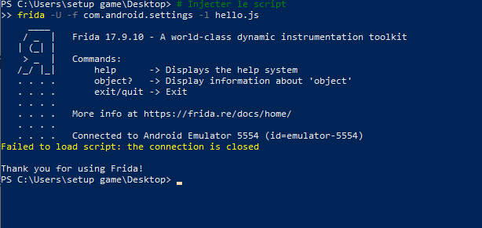
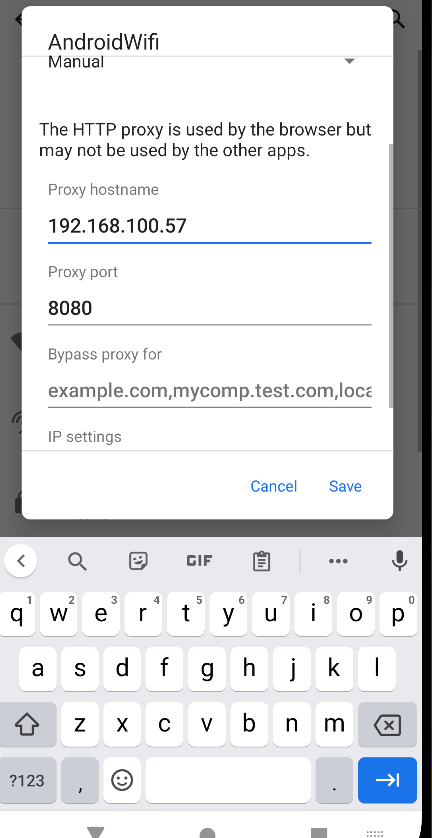
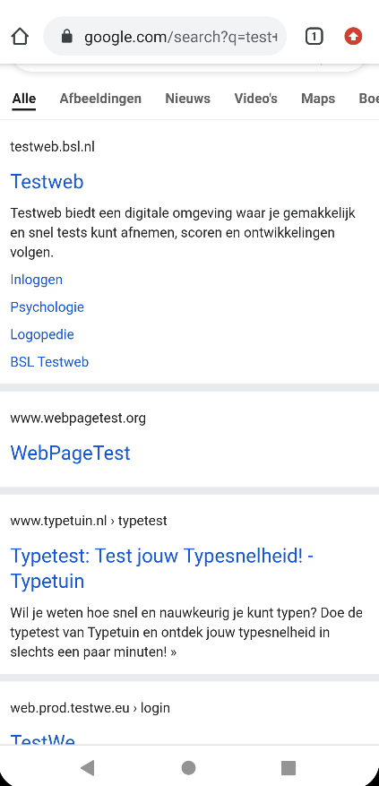

# 🔐 Inspection TLS/HTTPS et Contournement du SSL Pinning

## 📌 Présentation du laboratoire

Ce laboratoire a pour objectif d’analyser le trafic réseau chiffré d’une application Android dans un environnement contrôlé.

L’étude porte principalement sur le mécanisme de **SSL Pinning**, une protection empêchant l’interception des communications HTTPS même lorsqu’un certificat CA personnalisé est installé sur l’appareil.

L’objectif est donc de rendre le trafic HTTPS lisible afin d’observer les échanges entre l’application mobile et le serveur distant.

---

# 🎯 Objectifs techniques

Les différentes étapes du laboratoire consistent à :

- Mettre en place un proxy réseau entre l’émulateur Android et la machine d’analyse
- Installer un certificat CA afin d’autoriser l’inspection TLS
- Utiliser Frida pour désactiver dynamiquement les vérifications SSL de l’application
- Intercepter et analyser les requêtes HTTPS générées par l’application

---

# ⚖️ Cadre légal et éthique

Ce laboratoire s’inscrit dans un cadre strictement pédagogique et autorisé.

Les techniques présentées doivent être utilisées uniquement :

- sur un environnement de test,
- sur une application vous appartenant,
- ou avec une autorisation explicite.

---

# 🧰 Outils utilisés

## Frida

Utilisé pour :

- injecter des hooks dynamiques,
- contourner le SSL Pinning,
- modifier le comportement des bibliothèques SSL,
- observer l’exécution de l’application en mémoire.

## Burp Suite / mitmproxy

Utilisés pour :

- intercepter le trafic HTTPS,
- analyser les requêtes API,
- observer les réponses serveur,
- examiner les headers et données sensibles.

## Android Emulator

Utilisé comme environnement de test Android isolé.

---

# 🌐 Configuration du proxy réseau

Pour capturer le trafic HTTP/HTTPS, l’émulateur Android doit être configuré afin de rediriger tout son trafic réseau vers la machine hébergeant le proxy d’analyse.

## Paramètres appliqués

```text
Proxy Hostname : 192.168.100.57
Proxy Port : 8080
```

Une fois cette configuration appliquée :

- toutes les requêtes transitent par le proxy,
- mais les connexions HTTPS échouent encore,
- car l’application détecte un certificat non attendu.

Cette protection correspond au **SSL Pinning**.

---

# 🧪 Instrumentation dynamique avec Frida

Afin de contourner cette protection, une instrumentation dynamique est réalisée avec Frida.

L’objectif est de modifier les bibliothèques SSL directement en mémoire pendant l’exécution de l’application.

Les hooks ciblent notamment :

- TrustManager
- SSLContext
- Conscrypt
- OkHttp CertificatePinner

---

# 📜 Script universel de bypass SSL

Le script utilisé :

```text
sslpin_bypass_universal.js
```

applique plusieurs hooks simultanément afin de couvrir les principales implémentations SSL Android.

## Fonctionnement du script

### Hook de SSLContext

Injection d’un TrustManager permissif acceptant tous les certificats.

### Hook de TrustManagerImpl

Neutralisation des vérifications SSL de la bibliothèque Conscrypt utilisée sur Android 7+.

### Hook de OkHttp

Désactivation de :

```java
CertificatePinner.check()
```

Ce bypass empêche l’application de vérifier l’empreinte du certificat distant.

---

# ▶️ Exécution du bypass SSL

## Application ciblée

```text
owasp.mstg.uncrackable3
```

## Commande utilisée

```bash
frida -U -f owasp.mstg.uncrackable3 -l sslpin_bypass_universal.js
```

Une fois les hooks injectés :

- les vérifications SSL sont neutralisées,
- le certificat Burp devient accepté,
- les connexions HTTPS deviennent fonctionnelles.

---

# 🔍 Analyse des hooks appliqués

L’étude des logs Frida montre que l’application utilise principalement :

```text
com.android.org.conscrypt.TrustManagerImpl
```

Le hook appliqué sur cette classe est l’élément principal ayant permis :

- l’acceptation du certificat Burp,
- l’interception HTTPS,
- l’analyse du trafic en clair.

---

# 📡 Résultat de l’interception TLS

Après activation du bypass SSL Pinning :

- les requêtes API deviennent visibles,
- les headers HTTP peuvent être analysés,
- les endpoints API sont récupérables,
- les données échangées deviennent accessibles.

L’auditeur peut ainsi examiner :

- tokens d’authentification,
- cookies de session,
- endpoints API,
- données sensibles transitant sur le réseau.

---

# 🛡️ Conclusion

Ce laboratoire montre que même lorsqu’une application implémente du SSL Pinning, il reste possible de contourner cette protection grâce à l’instrumentation dynamique.

L’utilisation combinée de :

- Frida,
- hooks mémoire,
- proxy TLS,

permet de rendre transparentes les communications HTTPS d’une application Android.

Cette approche constitue une étape essentielle dans un audit mobile offensif, notamment pour :

- l’analyse des API,
- l’étude des mécanismes d’authentification,
- la recherche de données sensibles exposées,
- le test de sécurité des flux réseau chiffrés.

---

# 📚 Références sécurité

Ce laboratoire s’appuie sur les standards :

- OWASP
- OWASP MASVS
- OWASP MASTG

Catégories concernées :

- MASVS-NETWORK
- MASVS-RESILIENCE
- MASVS-AUTH
- MASVS-CRYPTO

---

# 📷 Screenshots

## 1. Configuration du proxy Android


---

## 2. Injection Frida / SSL Bypass


---

## 3. Interception HTTPS réussie


---
